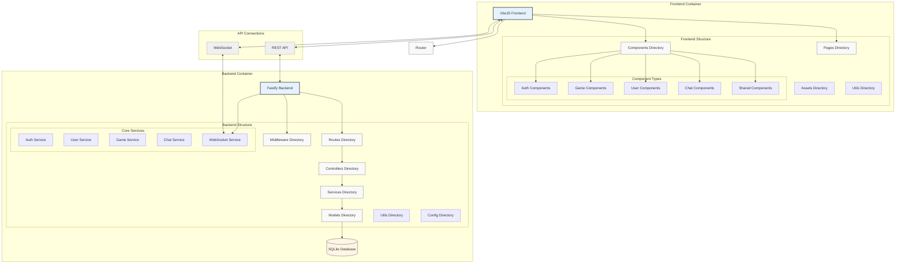
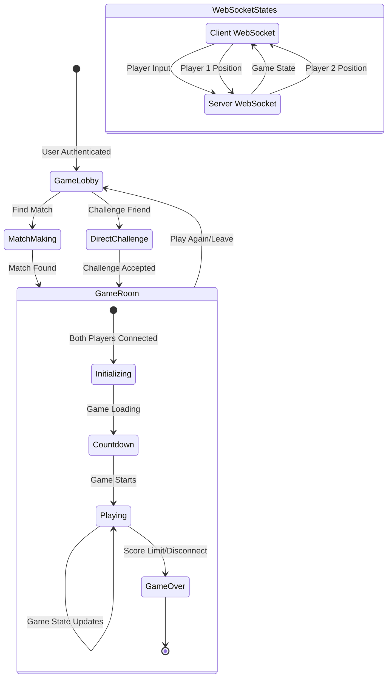
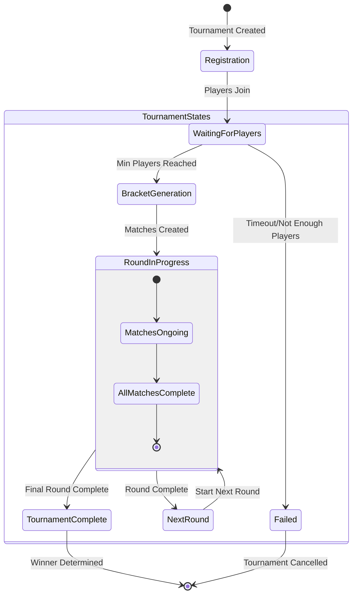

Transcendence 2025:

<h1>Project Logic</h1>

<h1>Game Logic</h1>

<h1>Tournament Logic</h1>

<header>Basic necessary Features:
    <ul>
        <li>Technologies:</li>
        - Frontend base: Typescript
        - Backend base: ->  refer to web modules
        - Single-Page application
        - Compatible with -> refer to accessibility modules
        - Application must run in: Docker
    </ul>
    <ul>
    <li>Game State:</li>
        - 2 Player participation mandatory -> refer to Gameplay module for additional info
        - Tournament system must be implemented -> consists of multiple players
        - Registration system is required -> refer to User Management module
        - All players must have the same gameplay rules (Paddle speed etc..)
        - Game must adhere to default frontend constraints -> refer to web for minor adjustment
        - Must replicate Flavor of original Pong 1972
    </ul>
    <ul>
    <li>Security minimums:</li>
        - Any password stored in DB needs to be #hashed#
        - Website must be protected against SQL/XSS attacks
        - Since backend is enabled -> mandatory to enable an HTTPS connection for all aspects
            (wss instead of ws for example)
        - Must implement validation mechanisms for forms and user input on server side
            ->   since backend is employed
        - API calls must be secured and routes need to be protected
        - credentials, API keys etc.. need to be stored in local .env file and be ignored by git.
    </ul>
</header>

<main>Features planned:
    <h1>Web:</h1>
        <ul>
        <li>Major: Fastify framework with Node.js for backend</li>
        <li>Minor: Tailwind CSS</li>
        <li>Minor: SQLITE Database</li>
        </ul>
    <h2>User Management:</h2>
        <ul>
        <li>Major: Standard user management</li>
            - Users can subscribe to the website
            - Registered Users can log in securely
            - Users can select unique display names to participate in tournaments
            - Users can update their information
            - Users can upload avata, with default option if none is provided
            - Users can add others as friends and view their online stats
            - User profiles display stats such as wins and losses
            - Each user has a Match History including 1v1 games, dates, relevant details(game scores) accessible only to logged in players
        </ul>
    <h3>Gameplay:</h3>
        <ul>
        <li>Major: Remote Players</li>
            - Remember serverside Pong module
            - implement by API Calls
        <li>Minor: Game customization</li>
            - Power Ups
            - different maps
            - animations(maybe)
            - Allow users to choose a default version with basic features
            - Ensure customization options are available to all games on the platform
            - Implement user-friendly setting menus/interfaces etc..
            - Maintain consistency with customization features
        <li>Major: Live Chat (up for debate)</li>
            - Direct message support
            - block players from messaging
            - send invites to other players
            - tournament should be able to send messages to registered players
            - should allow user to access other players profiles through the chat interface
                (hyperlinks smthing feature)
        </ul>
    <h4>AI</h4>
        <ul>
        <li>None (for now)</li>
        </ul>
    <h5>Cybersecurity</h5>
        <ul>
        <li>Minor: GDPR Compliance</li>
            - request anonymization of player data
            - provide tools to manage their local data, including view/edit/delete personal info
            - offer streamlined process to request permanent account deletion + associated data
            - Maintain clear/transparent communication with user regarding their data + options to exercise their rights
        <li>Major: 2FA and JWT</li>
            - Implement 2Factor Authentication
            - Utilize JSON Web Tokens for authentication and authorization
            - Provide user-friendly setup process for enablig 2FA with options: SMS, app, email
            - Ensure JWT are issued and validated securely to prevent unauthorized access
        </ul>
    <h6>DevOps</h6>
        <ul>
        <li>Major: Log Management</li>
            - add ELK log management (Elasticsearch, Logstash, Kibana)
        <li>Minor: Monitoring System</li>
            - implement Prometheus/Grafana for system monitoring
        </ul>
    <h7>Graphic modules</h7>
        <ul>
        <li>None planned</li>
        </ul>
    <h8>Accessibility</h8>
        <ul>
        <li>Minor: Support on all devices</li>
            - options for screen size (tablets, laptops, desktop, smartphone)
            - options for input (touch, mouse etc..)
        <li>Minor: Expand Browser Compatibility</li>
            - Mozilla Firefox (100% Required)
            - Google Chrome
            - Safari
        </ul>
    <h9>Serverside Pong</h9>
        <ul>
        <li>Major: Replace Pong with Serverside Pong</li>
            - Developr server-side logic for Pong gameplay
            - create an API that exposes necessary resource and endpoints to interact, allowing partial usage via CLI and web interface
            - Design and implement API endpoints for game initialization, player controls and game state updates
            - Ensure serverside pong is responsive
            - integrate the serverside pong into the web application allowing users to play directly on the website
        </ul>
</main>